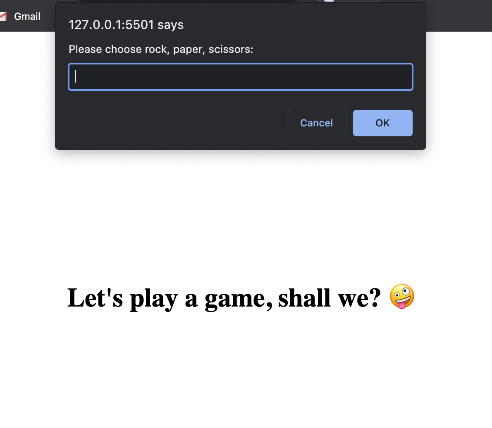

# Rock-Paper-Scissors
Rock-paper-scissors game

# Rock, Paper, Scissors

I build a rock-paper-scissors game using only JavaScript.

**Rules for rock-paper-scissors**

* Rock: wins against scissors, loses to paper, and ties against itself.
* Paper: wins against rock, loses to scissors, and ties against itself.
* Scissors: wins against paper, loses to rock, and ties against itself.

### Instructions

* Begin the process of coding out the rock-paper-scissors game.

* As a user:
  * I want to play Rock, Paper, Scissors against an automated opponent.
  * I can enter R, P, or S to signify my choice of rock, paper, or scissors.
  * I expect the computer to choose R, P, or S in return.
  * I want the option to play again whether I win or lose.
  * I want to see my total wins, ties, and losses after 3 rounds.

* The computer's selection must be random to ensure a fair game.

## Usage 

Interact with the alert on your screen to play the game

Deployed link: https://ginacamelia.github.io/Rock-Paper-Scissors/

## Credits 
 
N/A

## License
Refer to License in the repository